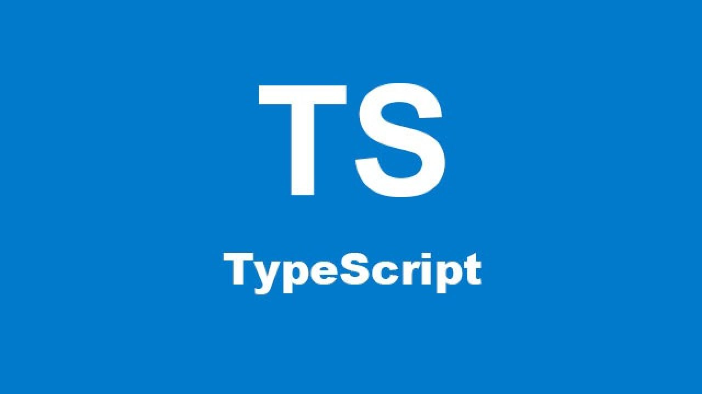

# TypeScript

TypeScript (TS) es un lenguaje de programación libre y de código abierto desarrollado y mantenido por Microsoft. Es un superconjunto de JavaScript (JS), que esencialmente añade tipos estáticos y objetos basados en clases. TS es usado para desarrollar aplicaciones JavaScript que se ejecutarán en el lado del cliente o del servidor.

TS extiende la sintaxis de JS, por tanto cualquier código JS existente debería funcionar sin problemas. TS está pensado para grandes proyectos, los cuales a través de un compilador de TS se traducen a código JS.

El compilador de TS está escrito asimismo en TS, compilado a JS y con Licencia Apache 2.

## Caracteristicas de TypeScript

1. TS es un superconjunto de JS. TS usa la misma sintaxis que JS pero además añade la suya propia. Si tu tienes un programa hecho con JS sin ningun error de sintaxis, entonces también tienen un programa hecho en TS. Esto puede resultar muy util si quieres migrar un programa JS a TS.

2. Cuando compilamos un fichero TS se genera otro fichero JS, es decir, primero escribimos el codigo en TS y luengo lo compilamos generando de esta manera un fichero JS.

3. Una vez tienes el fichero JS, lo puedes desplegar en cualquier entorno que pueda ejecutar JS.
4. Los ficheros TS tienen extensión <b>.ts</b> mientras que los ficheros JS tienen extensión <b>js</b>. 

## Compilación y ejecución

Para compilar un fichero TS debemos de usar el comando de compilación <b>tsc FICHERO_TYPESCRIPT.ts</b> y se nos creará el fichero <b>FICHERO_TYPESCRIPT.js</b>. 

Si tenemos <b>NodeJs</b> instalado (lo más habitual), podemos ejecutar cualquier fichero JS mediante el comando <b>node</b> del fichero .js que queramos ejecutar en una terminal de VSC. Ej: <b>node FICHERO_TYPESCRIPT.js</b>. 

## Ventajas de TypeScript

Las principales ventajas de TS son:

1. <b>Sistema de tipos</b>
2. <b>Mejora de productividad evitando errores</b>

### Sistema de tipos

El sistema de tipos de Typescript realiza una formalización de los tipos de Javascript. Esto permite a los desarrolladores definir variables y funciones tipadas sin perder la esencia de Javascript. Poder definir los tipos durante el tiempo de diseño nos ayuda a evitar errores en tiempo de ejecución, como podría ser pasar el tipo de variable incorrecto a una función.

### Mejora de productividad evitando errores

Los lenguajes tipados tienen ventajas, entre ellas mejorar la productividad evitando errores en tiempo de ejecución mediante el uso de tipos

Imaginemonos la siguiente función de sumar dos numeros hecha en JS.

    function add(x, y) {
        return x + y;
    }

y la llamamos de la siguiente manera

    let result = add(input1.value, input2.value);
    console.log(result); // Mostrariamos el resultado de concatenar dos String

Si los valores de input1 e input2 fueran 10 y 20 respectivamente, mostraríamos por consola <b>1020</b> en lugar de <b>30</b> ya que los valores de los campos son siempre String, así pues, al usar el operador <b>+</b> concatenamos en lugar de sumar.

TypeScript al ser un lenguaje tipado declarariamos la función de la siguiente manera

    function add(x: number, y: number) {
        return x + y;
    }

Por lo que al al llamar a la función de la siguiente manera

    let result = add(input1.value, input2.value);

Nos daria un error en tiempo de compilación, ya que la función espera que sean números y nosotros le estamos pasando cadenas (String). TS puede ayudar a prevenir errores en tiempo de compilación.

## Consideraciones importartes a la hora de trabajar con TS y VSC

1. La terminal de VSC usa powershell para ejecutar los comandos, por lo que debemos de permitir usar el comando <b>tsc</b> ejecutando el comando <b>set-executionpolicy remotesigned</b> una única vez dentro del terminal de VSC antes de ejecutar el comandos de compilación (tsc). Otra solución puede ser ejecutar el comando <b>tsc.cmd</b> en lugar de ejecutar solamente <b>tsc</b> cada vez que queramos ejecutar el comando, pero eso haría más lento el desarrollo.

2. Los ficheros JS generados al compilar los TS <b>NO</b> deberían de tocarse. Si queremos cambiar código debemos hacerlo en los ficheros TS y volver a compilarlos.

3. Tener abierto al mismo tiempo .ts y su correspondiente fichero .js puede dar error en VSC. Se recomiendo solamente abrir los ficheros .ts.

4. Por defecto, el compilador de TS no utiliza las últimas versiones de JS como ETMAScript 5 o 6 (ES5 y ES6) por lo que tenemos que tenerlo en cuenta a la hora de compilar el codigo usando las caracteristicas más modernas de JS. Si queremos usar una versión especifica para compilar un fichero TS podemos hacerlo de 2 maneras:
    - Con el comando <b>tsc -t esX FICHERO_TYPESCRIPT.ts</b>. Donde la "X" es la version del ETMAScript. Un ejemplo sería <b>tsc -t es6 fichero.ts</b> para ETMAScript 6.
    - Creando un fichero de configuración llamado <b>tsconfig.json</b> y especificando ahi la versión de ES que utilizaremos. Dicho fichero se buscará automáticamente desde la carpeta raiz donde invoquemos el comando "tsc". <b>IMPORTANTE:</b> Cuando ejecutamos el compilador de TS mediante el fichero de configuración ya no debemos de poner el nombre del fichero o ficheros que queremos compilar, ya que por defecto buscará todos los ficheros .ts que haya para compilarlos a .js. De esta manera, solo poniendo el comando <b>tsc</b> en el directorio donde esté el fichero <b>tsconfig.json</b> sería suficiente. El fichero de configuración debe de tener al menos el siguiente json:

            {
                "compilerOptions": {
                "target": "es6"
                }
            }

        Donde "es6" sería la versión de TS que vamos a usar. Se puede tomar como ejemplo el fichero que está en <b>04_TS_Clases</b>, no será hasta este ejemplo cuando necesitemos la version 6 de ETMAScript.

5. Existe una manera de estar compilando de manera automática todos los cambios de los ficheros .ts a ficheros .js (de manera parecida a lo que hace eclipse con los .java, que los convierte a .class sin que tengamos que usar el compilador). Para ello debemos abrir una terminal y ejecutar el comando <b>tsc -w -p .
 (notese el "." del final), y cada vez que cambiemos un fichero .ts se creara automaticamente su fichero .js. Lo ideal será tener 2 terminales, una para compilar automáticamente y otra para ejecutar los ficheros .js. **IMPORTANTE** Para hacer esta practica debemos de tener el fichero <b>tsconfig.json</b> en el directorio donde ejecutemos el comando <b>tsc -w -p .

## Bibliografía

- <https://www.typescriptlang.org/)>
- <https://www.tutorialspoint.com/typescript/>
- <https://www.typescripttutorial.net/>
- <https://softwarecrafters.io/typescript/typescript-tutorial-javascript-introduccion>