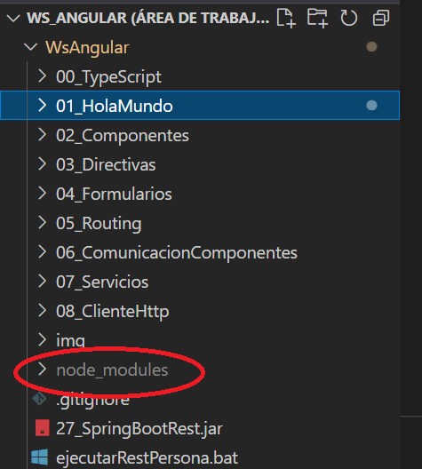

# Conceptos de Angular

Dentro de una aplicación Angular podemos encontrar ciertos conceptos fundamentales. La construcción básica de Angular son los **componentes** que están organizados dentro **modulos** de Angular o **NgModules**. Una aplicación Angular esta definida como un conjunto de módulos y tiene que tener al menos una módulo raiz, llamado **AppModule**.

Normalmente una aplicación Angular importa varios módulos para proporcionar nuevas funcionalidades, por ejemplo, para trabajar con formularios es muy tipico importar el módulo **FormModule**.

Los **componentes se definen en clases** que contiene datos y lógica de la aplicación. Además, estas clases tendrán asociadas una plantilla HTML (estructura) y un fichero CSS (estilos).

Un componente en angular se crea mediante el decorador **@Component**. Los decoradores son funciones que modifican el comportamiento de las clases de JavaScript.

Por otra parte, podemos encontrar otros elementos como los **servicios**, cuya función es la de proporcionar datos de los servidores a nuestros componentes.

Hablaremos de estos temas con más profundidad más adelante.

## Creación de este proyecto

Este proyecto ha sido creado mediante la CLI de angular con el comando:

    ng new 01_Introduccion

## Composición de un proyecto Angular

1. Todos los ficheros creados en la raíz del proyecto pertenecen a la configuración general de un proyecto angular. Los más importantes:

    - <b>angular.json</b>, donde está la mayor parte de nuestra configuración del proyecto Angular
    - <b>package.json</b>, donde están declarados comandos y versiones de Angular.
    - <b>tsconfig.json</b>, donde están declaradas la configuración de TS.

2. Los directorios que empiezan por <b>.</b> (punto) son ficheros ocultos que son usados principalmente por el IDE o el framework de Angular. No tienen importancia a la hora de desarrollar.

3. La carpeta <b>src</b> es la carpeta más importante de nuestra app, ya que sobre esta será donde trabajemos en el desarrollo de la misma. Aquí podemos encontrar diferentes subcarpetas y ficheros:

    - index.html, será la página inicial de nuestra app
    - styles.css, los estilos globales a toda nuestra app
    - assets, donde podemos poner los ficheros que queremos que sean visibles a los usuarios (imagenes, .txt, etc)
    - app, será la carpeta donde trabajaremos con nuestros componentes. Raíz de todos los demás componentes que creemos.

4. La carpeta <b>node_modules</b> contiene las librerias que nos permiten ejecutar las app de angular. Dicha carpeta tampoco será útil a la hora de desplegar una app en un servidor, solo es útil en desarrollo.

**NOTA IMPORTANTE:** En el caso de este WsAngular <b>NO</b> vamos a tener la carpeta <b>node_modules</b> en los directorios raíces de los proyectos individuales, la vamos a tener en el directorio raíz del <b>WsAngular</b>. Esto es porque dicha carpeta pesa alrededor de 300MB y así evitamos tener en el ordenador 300MB por proyecto Angular. Node sigue trabajando igual, aunque tengamos la carpeta <b>node_modules</b> en el directorio raiz del WS en vez de en cada proyecto. 

Para borrar esta carpeta podemos hacerlo desde el editor con boton derecho, eliminar. Tambien podemos ejecutar el comando **npx npkill** en el proyecto y siguiendo las instrucciones. Podemos seguir [este video tutorial](https://www.youtube.com/watch?v=xVG20-7egDI) para más información.

Además, en este repositorio, no tenemos versionada la carpeta **node_modules** por el espacio que ocupa y porque no aporta nada al código (ver fichero .gitignore), por lo que cuando descarguemos este workspace debemos de generar la carpeta **node_modules** a partir de un proyecto y copiarla dentro de **WsAngular**.

Para generar la carpeta <b>node_modules</b> debemos ejecutar sobre la raiz de un proyecto (por ejemplo 01_Introduccion) el siguiente comando:

    npm install

Y esto hará que se cree la carpeta <b>node_modules</b>. Una vez hecho esto, podemos dejarla ahi o podemos moverla a WsAngular para que funcione en todos los proyectos.

## Arrancar la aplicación en angular

Sobre la raíz del proyecto ejecutaremos el comando <b>ng serve -o</b>. Una vez arrancado, todos los cambios que realicemos sobre nuestra aplicación se recompilaran automáticamente, por lo que no hace falta parar y arrancar el servidor. Además, el servidor mandará una señal al navegador para que se actualice.

## Cambiando nuestra aplicación

En este caso vamos a ir al fichero <b>app.component.html</b> dentro de la carpeta <b>app</b> y dejaremos solo la siguiente línea

    Mi primera APP en angular se llama 01_Inroducción

Al recargar el navegador deberemos de observar los cambios.

Si nos vamos al fichero <b>index.html</b> podemos ver que hay una etiqueta que se llama <b>app-root</b>, esta etiqueta hace mención a dicho componente, que está definido en el fichero <b>app.component.ts</b>. 

## Bibliografia

- <https://angular.io/guide/architecture>