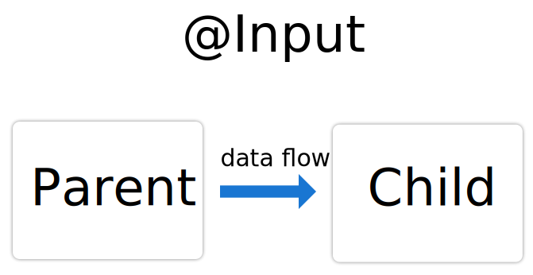

# 06ComunicacionComponentes

This project was generated with [Angular CLI](https://github.com/angular/angular-cli) version 13.1.4.

## Comunicación entre componentes Angular

Normalmente en una aplicación Angular tendremos muchos componentes declarados, además que es muy probable que tengamos relaciones de padres a hijos entre los componentes (desplegar etiquetas componente dentro de otras etiquetas componente). Ej.

    <parent-component>
        <child-component></child-component>
    </parent-component>

El componente **parent-component** servirá como contexto para el **child-component** y para realizar comunicaciones entre ambos componentes usaremos los decoradores **@Input()** y **@Output()**.

- **@Input()** permite al componente padre modificar datos en el componente hijo.

- **@Output()** permite al componente hijo enviar datos al componente padre. Esta manera no es muy utilizada ya que crea dependencias fuertes y poca reutilización de los componentes hijos.

El objetivo de esta modularizar los componentes, es el poder reutilizar componentes a lo largo de nuestra aplicación.

## Visualizando el ejemplo

Para este caso vamos a coger como base el ejemplo anterior **04_Formularios** y lo vamos a adaptar a un modelo de padres e hijos, en vez de tenerlo todo en un solo componente.

Para ello haremos el componente **heroes** y el componente **heroe**, y repartiremos en cada uno de ellos la funcionalidad del ejemplo anterior. El componente **heroe** pintará únicamente el héroe que
le pase el componente **heroes**.

El componente héroe debe de tener un atributo decorado con **@Input** para poder recibirlo.

De esta manera, podremos usar el componente **heroe** dentro del componente **heroes**, pero además podremos usarlo en cualquier otra parte de nuestra aplicación de manera independiente.

## Bibliografía

- <https://angular.io/guide/inputs-outputs>

