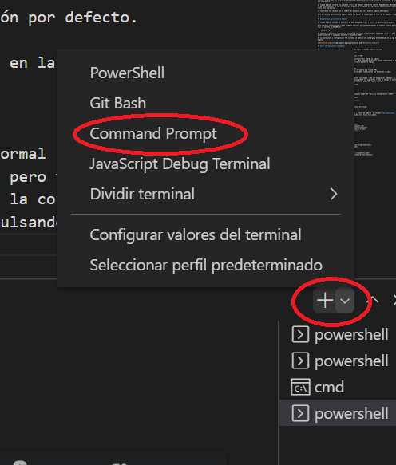
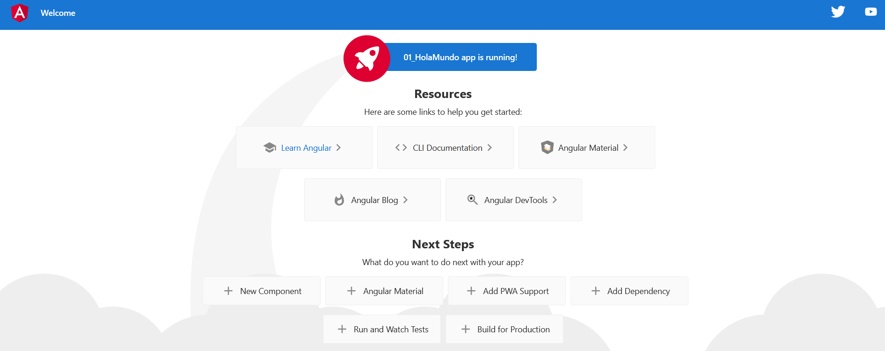
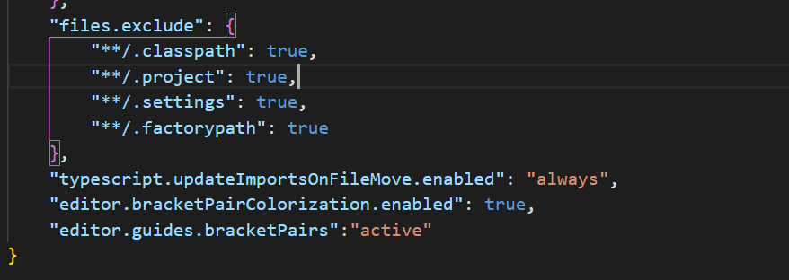

# Angular

<b>Angular</b> es un framework para aplicaciones web desarrollado en TypeScript, de código abierto, mantenido por Google, y que se utiliza para crear aplicaciones web de una sola página (Single Page Application o SPA) bajo el patrón Modelo-Vista-Controlador (MVC). No se debe confundir con **AngularJS** que sería la primera versión y se considera obsoleta.

## Prerrequisitos

Para trabajar con Angular se deben de tener conocimiento de las siguientes tecnologías:

1. Conocimientos en **JavaScript**
2. Conocimientos en **HTML**
3. Conocimientos en **CSS**

También sería recomendable tener conocimientos en **TypeScript**, aunque no es obligatorio. 

## Herramientas para trabajar con Angular

Las herramientas que vamos a utilizar para trabajar con Angular son las siguientes

1. Visual Studio Code (VSC). Será el IDE que usaremos para nuestro workspace, aunque podremos utilizar cualquier IDE. Enlace para descargar: <https://code.visualstudio.com/download>. NOTA: Todos los comandos que se muestran en este fichero se pueden ejecutar abriendo una terminal en VSC.
2. NodeJs. Es un entorno de ejecución de JavaScript orientado a eventos asincronos. El uso principal será para la creación de aplicaciones web como servidor de peticiones HTTP. Enlace para descargar: <https://nodejs.org/es/download/>. NOTA: Cuando instalemos NodeJs debemos de reiniciar VSC para que reconozca los comandos.

Cuando instalemos ambas herramientas dejaremos las opciones de instalación por defecto.

Para comprobar que NodeJs se ha instalado adecuadamente podemos ejecutar en la consola el comando 
    
    node -v

## TypeScript (TS) y JavaScript (JS)

El lenguaje que utiliza Angular es TypeScript (TS) por lo que también lo deberemos de tener instalado. Existen varias maneras de instalar TS, nosotros usaremos el gestor de paquetes <b>npm</b> que viene incluido en <b>NodeJs</b>.

TS es un superconjunto de JS, y cuando se compila, se convierte en código JS. Una de las diferencias fundamentales con JS es que TS es un lenguaje que admite tipado de las variables.

### NPM

<b>npm</b> son las siglas de Node Package Manager o gestor de paquetes de Node. Se utiliza principalmente para compartir herramientas, instalar módulos y administrar sus dependencias.

Esta herramienta funciona de dos formas:

1. Como un repositorio ampliamente utilizado para la publicación de proyectos de código abierto. Lo que significa que es una plataforma en línea donde cualquiera puede publicar y compartir herramientas escritas en JavaScript.
2. Como una herramienta de línea de comandos para acceder a proyectos en internet. Esto ayuda a instalar y desinstalar paquetes, gestión de versiones y gestión de dependencias necesarias para ejecutar un proyecto.

<b>npm</b> lo utilizaremos principalmente para instalar <b>Typescript</b> y **Angular** (una única vez).

Vamos a ver algunos comandos útiles de <b>npm</b>, estos comandos deben de ejecutarse en una terminal o símbolo de sistema.

- Instalar un paquete

        npm install -g NOMBRE_DEL_PAQUETE

- Listar los paquetes instalados

        npm list -g

- Borrar un paquete

        npm uninstall NOMBRE_DEL_PAQUETE

Todos los modulos que se instalen con <b>npm</b> se pueden encontrar en la siguiente ruta de windows:

    %USERPROFILE%\AppData\Roaming\npm\node_modules

### Instalación de TypeScript

Este WS está creado con la versión 4.5.4 de TS.

Para instalar las librerías de TS debemos de tener instalado [NodeJs](https://nodejs.org/es/). Una vez instalado, debemos arrancar símbolo de sistema en Windows en modo administrador y ejecutar el siguiente comando:

    npm install -g typescript@4.5.4

También podemos instalar la ultimá versión de TS eliminando **@4.5.4**

    npm install -g typescript

Con el siguiente comando podemos comprobar que versión de TS tenemos instalada y así asegurarnos que se ha instalado correctamente

    tsc -v

**IMPORTANTE:** El comando **tsc** se puede ejecutar en una linea de comandos normal (cmd) o dentro de la terminal de VSC. VSC por defecto abre las terminales con **powershell**, pero también nos da la opción
de abrirlo con **cmd**. **powershell** es posible que de problemas según la configuración de cada usuario, por lo que podemos cambiar a una terminal **cmd**, en ese caso pulsando el desplegable del boton **+** y eligiendo **command prompt**.

## Instalar la CLI de Angular (Interfaz de Linea de Comandos)

Utilizaremos la CLI de Angular para crear proyectos, generar código de aplicaciones y bibliotecas, y realizar una variedad de tareas de desarrollo, como pruebas, agrupación e implementación. Debemos de tener instalado [NodeJs](https://nodejs.org/es/).

Los proyectos Angular de este WsAngular están generados con la versión **13.1.4**. Para instalar esta versión en nuestro ordenador debemos de ejecutar el comando (COMO ADMINISTRADOR)

    npm install -g @angular/cli@13.1.4

También podemos instalar la ultimá versión de Angular eliminando **@13.1.4**

    npm install -g @angular/cli

También podemos ver información sobre Angular (Últimas versiones, distribución, etc.)

    npm view @angular/cli

## Crea un espacio de trabajo y una aplicación inicial

Para crear una aplicación debemos ejecuta el comando CLI <b>ng new</b> y proporciona el nombre que desees. 

    ng new NOMBRE_PROYECTO_ANGULAR

El comando <b>ng new</b> solicitará información sobre las funciones que debe incluir en la aplicación inicial. Aceptaremos los valores predeterminados presionando la tecla “Enter” y escribiendo "y" cuando nos lo pregunte.

La CLI de Angular instala los paquetes **npm** de Angular necesarios y otras dependencias. Esto puede tardar unos minutos. La CLI crea un nuevo espacio de trabajo y una aplicación de bienvenida simple, lista para ejecutarse.

La CLI creara una carpeta con el nombre del proyecto que será nuestro **espacio de trabajo**.

Para borrar una aplicación en Angular basta con borrar la carpeta que se creo con el comando <b>ng new</b>

## Ejecutar una aplicación en Angular

La CLI de Angular incluye un servidor, de modo que puede crear y servir la aplicación localmente.

Para arrancar la aplicación creada, podemos ejecutar el siguiente comando en nuestro espacio de trabajo (Ej: la carpeta 01_Introduccion).

    ng serve -o

El comando <b>ng serve</b> inicia el servidor y construye la aplicación. La opción <b>-o</b> abre automáticamente el navegador en <http://localhost:4200>

Si la instalación y configuración fue exitosa, se debería ver una página de bienvenida en la app de Angular.

## Parar una aplicación en Angular

Pulsaremos <b>CTRL+C</b> sobre la terminal donde hemos arrancado nuestro servidor

## Extensiones recomendadas en Visual Studio Code

Se recomienda instalar las siguientes extensiones en VSC:

1. <b>Angular Language Service</b>, una ayuda para escribir código en Angular
2. <b>Angular Files</b> y <b>Angular Support</b>, para crear de manera más rapida componentes en Angular
3. <b>Prettier - Code formatter</b>, para dar formato a nuestro código

Extensiones optativas:

1. <b>Beautify</b>, para trabajar con HTML y CSS.
2. <b>Angular 2 TypeScript Emmet</b>, para crear de manera más rápida HTML.
3. <b>Markdown Preview Enhanced</b>, para ver procesados los ficheros con extensión **.md**.

## Configuraciones especiales

Si queremos hacer que los simbolos especiales esten coloreados, como por ejemplo los simbolos **()[]{}** y conseguir que el código sea más legible, debemos añadir las siguientes líneas de código en el fichero de configuración **settings.json** (al final de fichero, antes del cierre **}**): 

    "editor.bracketPairColorization.enabled": true,
    "editor.guides.bracketPairs":"active"

Para abrir el fichero **settings.json**:

1. pulsar **ctrl + mayusculas + p**
2. Escribir **settings.json**, a continuación debemos elegir de "Abrir la configuración (JSON)"

Debería quedar algo parecido a la siguiente imagen

## Workspace WsAngular

El repositorio Angular se encuentra en la siguiente dirección:

<https://github.com/fdepablo/WsAngular>

En WsAngular nos vamos a encontrar con ejemplos y teoria de Angular. La carpeta **00_TypeScript** tiene ejemplos y teoría sobre fundamentos de TS que puede ser útiles como apoyo.

## Bibliografía

### Angular

- [Página oficial de Angular](https://angular.io/)
- [Página de Angular en español](https://docs.angular.lat)
- <https://code.visualstudio.com/docs/nodejs/angular-tutorial>
- <https://desarrolloweb.com/manuales/manual-angular-2.html>
- <https://www.tutorialspoint.com/angular8/index.htm>

### NodeJs

- <https://nodejs.org/es/>

### NPM

- <https://docs.npmjs.com/>
- <https://www.freecodecamp.org/espanol/news/node-js-npm-tutorial/>
- <https://www.hostinger.es/tutoriales/que-es-npm>

### Otros enlaces de interés

- [IDE en linea para diversos lenguajes](https://stackblitz.com/)
- [Tutorial de MarkDown](https://www.markdownguide.org/basic-syntax/)
- <https://www.w3schools.com>
